# How to Root Nothing Phone (1)

#### This HowToRoot guide will be using magisk framework, android sdk platform tools, and payload-dumper-go to root the NothingPhone (1) the easiest way posible, if prefered a script is made to automaticlly root the Nothing Phone (1).
---
Download on the computer the Nothing Phone (1) same firmware installed on the device desired to root. 

`Check which version: Configuration --> about phone --> Software info`

Download NothingOS(1.1.2):

- Global
Full: https://android.googleapis.com/packages/ota-api/package/a244285dfb5aef198999463c2d55f353ed0e7b1b.zip

- Europe
Full: https://android.googleapis.com/packages/ota-api/package/0f77244380edcc46a4d60397f5c22ea911352bfe.zip
---
Extract all.

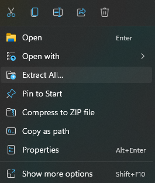

---
It is needed to dump the payload to get the NothingOS images.
Download payload-dumper-go:

https://github.com/ssut/payload-dumper-go

Use winrar to extract (payload-dumper-go-version).tar.gz file
Drag and drop the files inside the firmware folder extracted before.


---

Open cmd in the same directory and extract the firmware images:

```
payload-dumper-go payload.bin
```

Select the boot.img file inside the extracted folder and transfer it to the Nothing Phone (1) in the Downloads folder.

Plug Nothing Phone (1) device into the computer. Press Charging this device via USB.

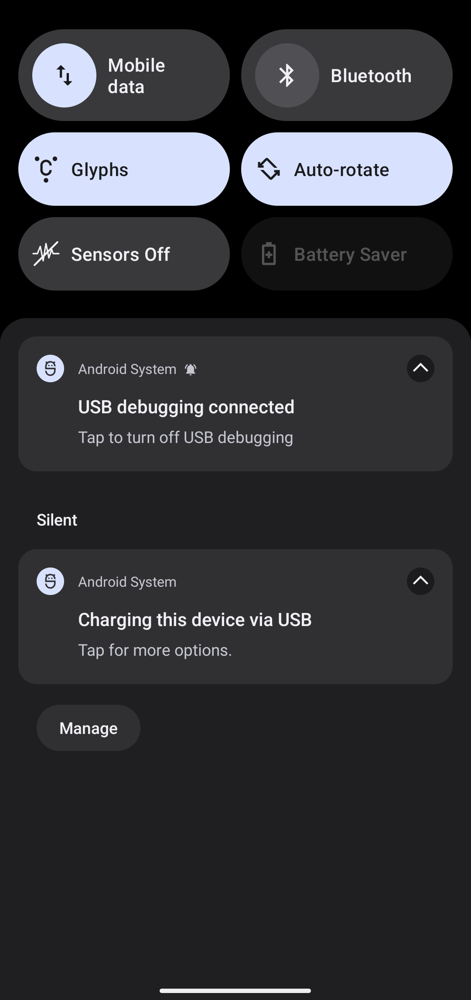

---

Select File Transfer preference.

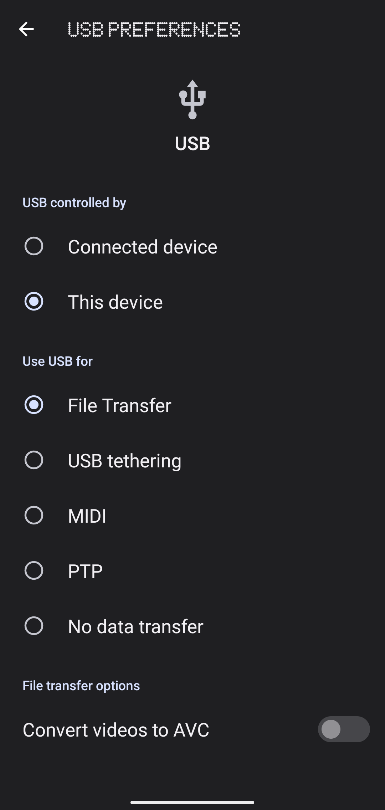

---

Get inside the Download folder of the Nothing Phone (1).

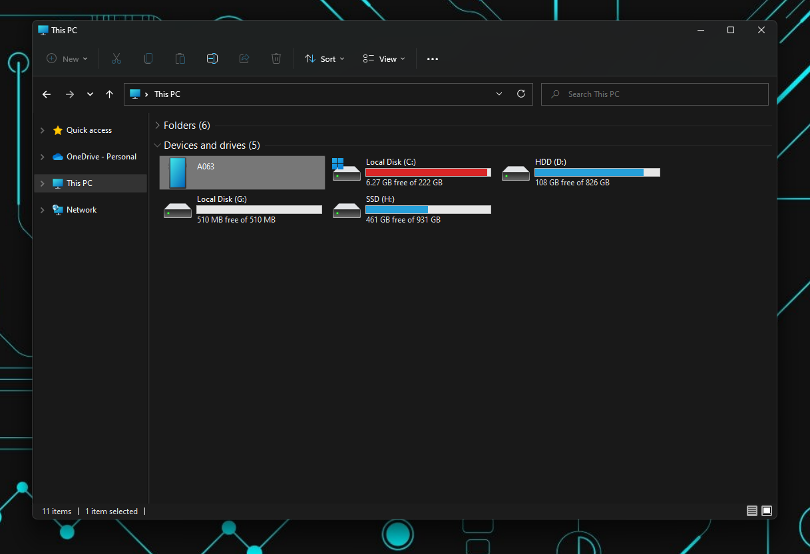

Drag drop it here:

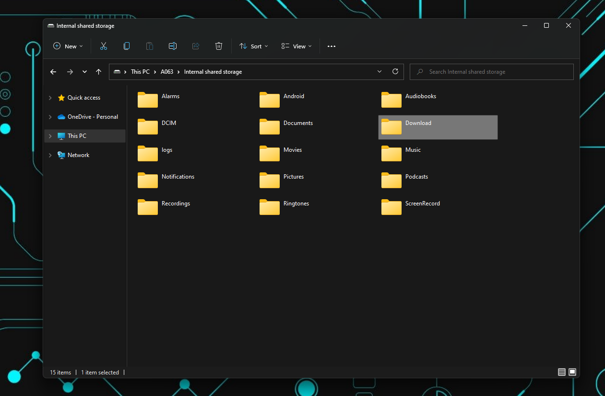

---

Change up to the Phone (1) device and download and install the magisk app.
Magisk: 
https://github.com/topjohnwu/Magisk
Choose Magisk.


---

Choose Magisk.apk.

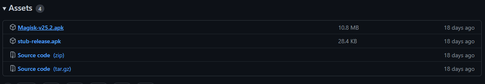

---

Select the Magisk.apk file located in your downloads and press install, allow install from its source.

Inside the app select Magisk Install.


---

Select and patch a File, and press let’s go.

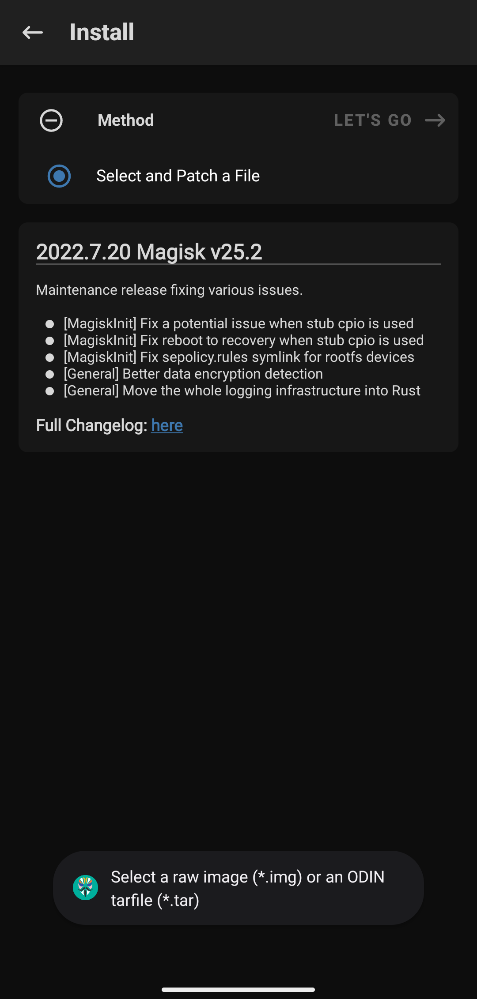

---

Select the boot.img located in downloads.

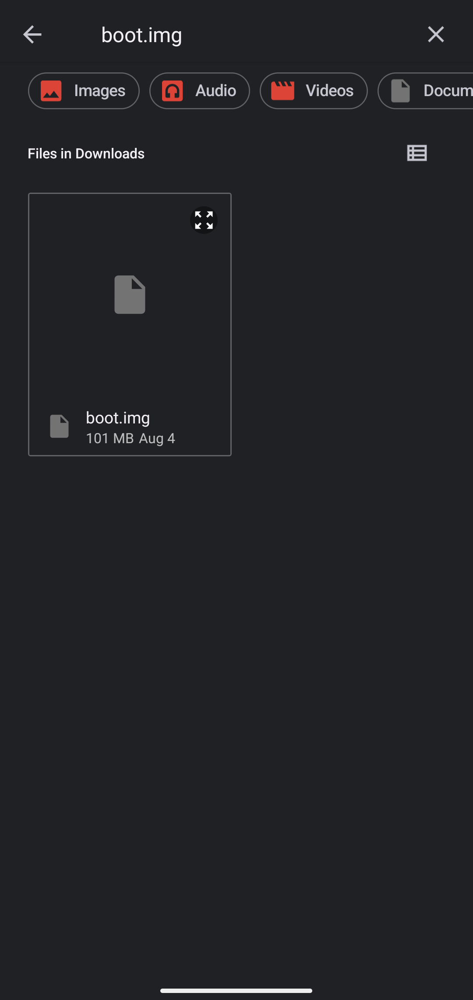

---

Once done select the patched file by magisk and transfer it to the computer following the same process as before.

Time to activate the USB debugging to interact with the phone while plugged in the PC.

First turn on Developer Options. Tap on Build number 5 times.

`Configuration → About Phone → System info → Build number`

Turn on USB debugging.

`Configuration → System → Developer options → USB Debugging on`

After this (if plugged to computer) should appear this message, accept it.

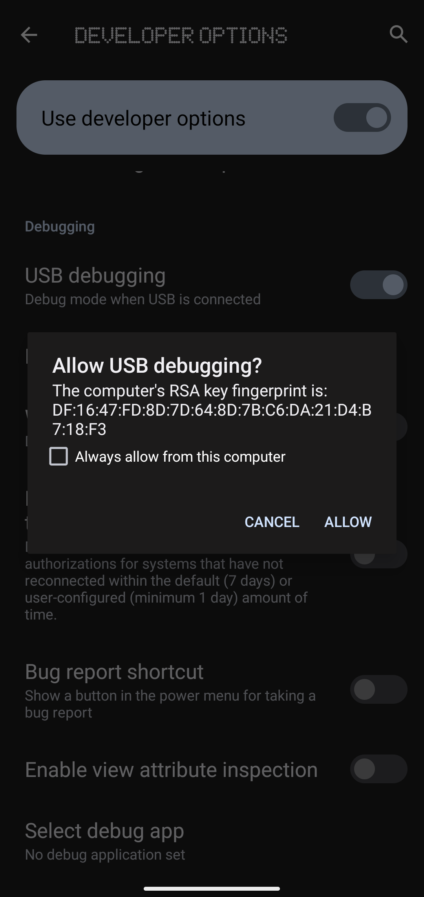

---

Now it's necessary to install in the computer the android sdk oficial tools to talk with the Nothing Phone (1).

Direct
 https://dl.google.com/android/repository/platform-tools-latest-windows.zip

Manual

https://developer.android.com/studio/releases/platform-tools

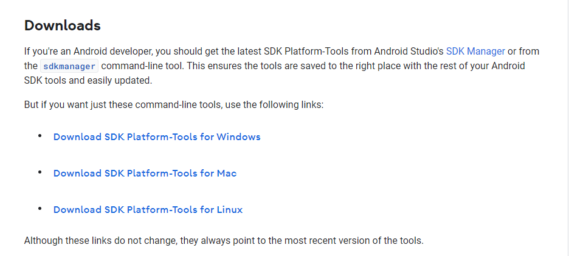

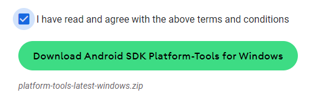

---

Move the zip file in the desktop and extract all.
Open cmd inside the folder  platform-tools_r33.0.2-windows/platform-tools.
To make sure that Nothing Phone (1) is plugged and the debugging mode is on, type:
```
C:\Users\tempestgf\Desktop\platform-tools_r33.0.2-windows\platform-tools\>adb.exe devices
```

Reboot the phone to fastboot 

adb reboot fastboot

Flash the rooted patched boot:

fastboot.exe flash boot magisk_patched-25200_PaoZC.img

Reboot the system:

fastboot.exe reboot

To check if the Nothing Phone (1) is rooted, open up the Magisk app and check if it appears as Installed, and you can access the superuser label.

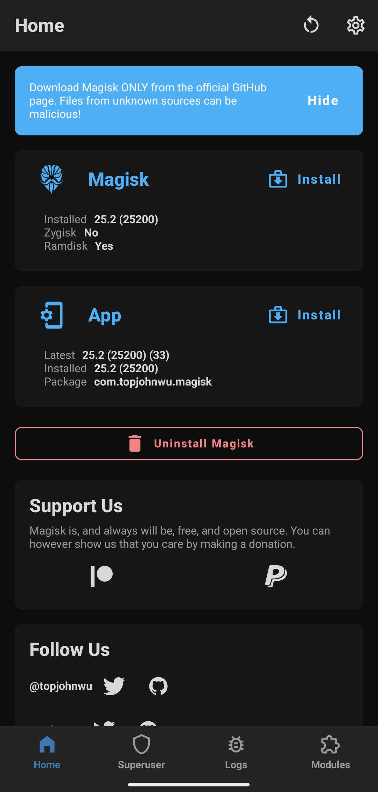

---

This has been the HowToRoot for the Nothing Phone (1), thanks for reading, questions will be answered if not repeated.

Contact: tempestgf@protonmail.com


